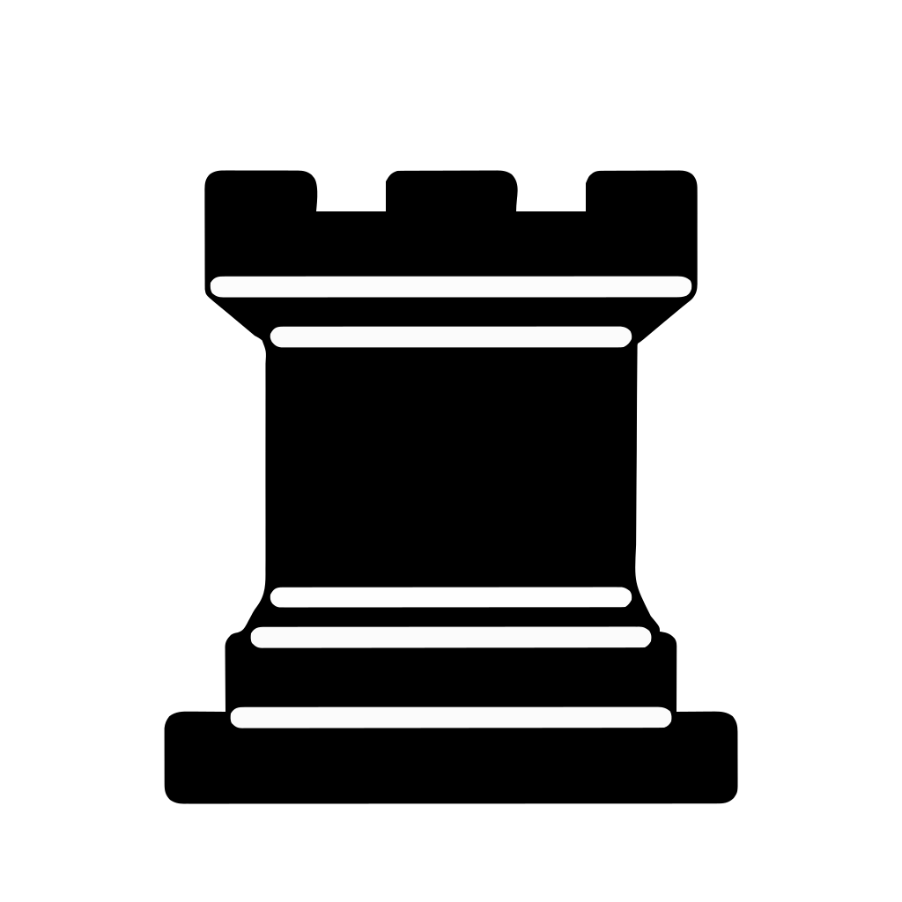
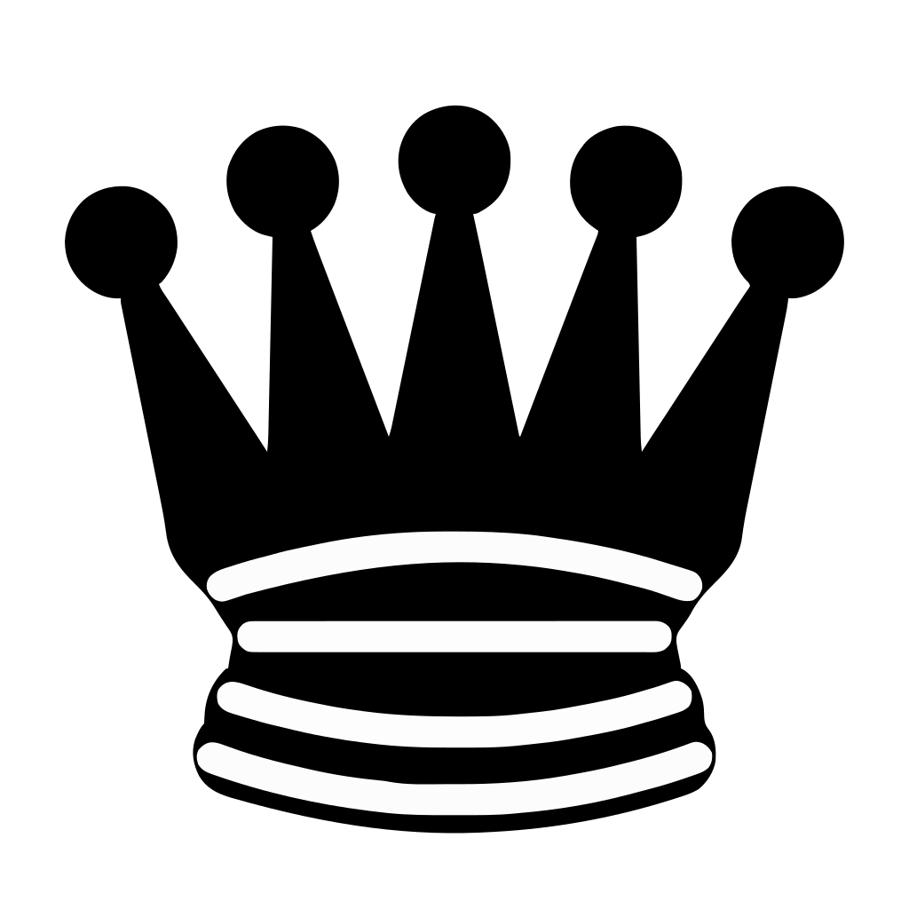
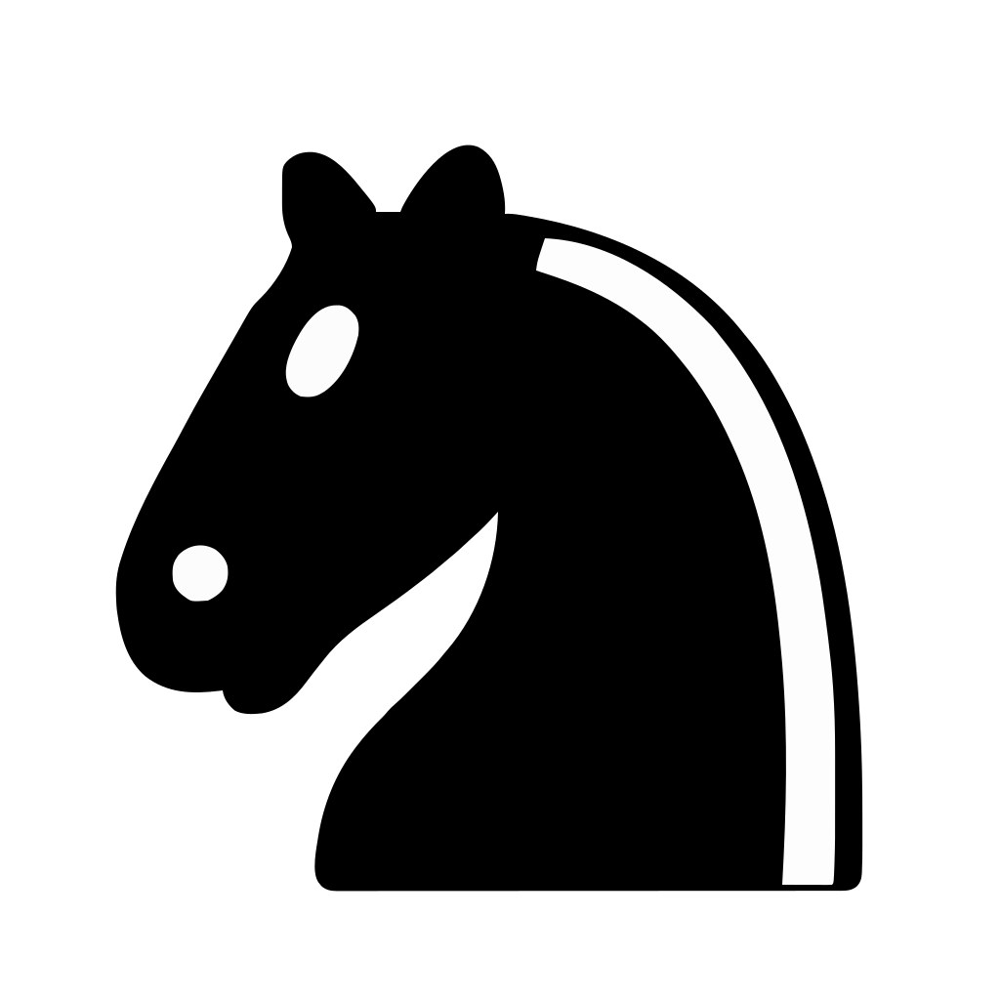

# GaslightGod's Online Open Chess Tournament

Select your next move! <!-- BEGIN TURN -->white<!-- END TURN --> to move

<!-- BEGIN CHESS BOARD -->
|   | A | B | C | D | E | F | G | H |   |
|---|:-:|:-:|:-:|:-:|:-:|:-:|:-:|:-:|:-:|
| **8** |  |  |  |  |  |  |  |  | **8** |
| **7** |  |  |  |  |  |  |  |  | **7** |
| **6** |  |  |  |  |  |  |  |  | **6** |
| **5** |  |  |  |  |  |  |  |  | **5** |
| **4** |  |  |  |  |  |  |  |  | **4** |
| **3** |  |  |  |  |  |  |  |  | **3** |
| **2** |  |  |  |  |  |  |  |  | **2** |
| **1** |  |  |  |  |  |  |  |  | **1** |
|   | **A** | **B** | **C** | **D** | **E** | **F** | **G** | **H** |   |
<!-- END CHESS BOARD -->

**It's your turn to move! Choose one from the following table**

<!-- BEGIN MOVES LIST -->
|  FROM  | TO (Just click a link!) |
| :----: | :---------------------- |
| **A2** | [A3](https://github.com/GaslightGod/GithubChess/issues/new?body=Please+do+not+change+the+title.+Just+click+%22Submit+new+issue%22.+You+don%27t+need+to+do+anything+else+%3AD&title=Chess%3A+Move+A2+to+A3), [A4](https://github.com/GaslightGod/GithubChess/issues/new?body=Please+do+not+change+the+title.+Just+click+%22Submit+new+issue%22.+You+don%27t+need+to+do+anything+else+%3AD&title=Chess%3A+Move+A2+to+A4) |
| **B1** | [A3](https://github.com/GaslightGod/GithubChess/issues/new?body=Please+do+not+change+the+title.+Just+click+%22Submit+new+issue%22.+You+don%27t+need+to+do+anything+else+%3AD&title=Chess%3A+Move+B1+to+A3), [C3](https://github.com/GaslightGod/GithubChess/issues/new?body=Please+do+not+change+the+title.+Just+click+%22Submit+new+issue%22.+You+don%27t+need+to+do+anything+else+%3AD&title=Chess%3A+Move+B1+to+C3), [D2](https://github.com/GaslightGod/GithubChess/issues/new?body=Please+do+not+change+the+title.+Just+click+%22Submit+new+issue%22.+You+don%27t+need+to+do+anything+else+%3AD&title=Chess%3A+Move+B1+to+D2) |
| **B2** | [B3](https://github.com/GaslightGod/GithubChess/issues/new?body=Please+do+not+change+the+title.+Just+click+%22Submit+new+issue%22.+You+don%27t+need+to+do+anything+else+%3AD&title=Chess%3A+Move+B2+to+B3), [B4](https://github.com/GaslightGod/GithubChess/issues/new?body=Please+do+not+change+the+title.+Just+click+%22Submit+new+issue%22.+You+don%27t+need+to+do+anything+else+%3AD&title=Chess%3A+Move+B2+to+B4) |
| **C1** | [D2](https://github.com/GaslightGod/GithubChess/issues/new?body=Please+do+not+change+the+title.+Just+click+%22Submit+new+issue%22.+You+don%27t+need+to+do+anything+else+%3AD&title=Chess%3A+Move+C1+to+D2), [E3](https://github.com/GaslightGod/GithubChess/issues/new?body=Please+do+not+change+the+title.+Just+click+%22Submit+new+issue%22.+You+don%27t+need+to+do+anything+else+%3AD&title=Chess%3A+Move+C1+to+E3), [F4](https://github.com/GaslightGod/GithubChess/issues/new?body=Please+do+not+change+the+title.+Just+click+%22Submit+new+issue%22.+You+don%27t+need+to+do+anything+else+%3AD&title=Chess%3A+Move+C1+to+F4), [G5](https://github.com/GaslightGod/GithubChess/issues/new?body=Please+do+not+change+the+title.+Just+click+%22Submit+new+issue%22.+You+don%27t+need+to+do+anything+else+%3AD&title=Chess%3A+Move+C1+to+G5), [H6](https://github.com/GaslightGod/GithubChess/issues/new?body=Please+do+not+change+the+title.+Just+click+%22Submit+new+issue%22.+You+don%27t+need+to+do+anything+else+%3AD&title=Chess%3A+Move+C1+to+H6) |
| **C2** | [C3](https://github.com/GaslightGod/GithubChess/issues/new?body=Please+do+not+change+the+title.+Just+click+%22Submit+new+issue%22.+You+don%27t+need+to+do+anything+else+%3AD&title=Chess%3A+Move+C2+to+C3), [C4](https://github.com/GaslightGod/GithubChess/issues/new?body=Please+do+not+change+the+title.+Just+click+%22Submit+new+issue%22.+You+don%27t+need+to+do+anything+else+%3AD&title=Chess%3A+Move+C2+to+C4) |
| **D3** | [A3](https://github.com/GaslightGod/GithubChess/issues/new?body=Please+do+not+change+the+title.+Just+click+%22Submit+new+issue%22.+You+don%27t+need+to+do+anything+else+%3AD&title=Chess%3A+Move+D3+to+A3), [A6](https://github.com/GaslightGod/GithubChess/issues/new?body=Please+do+not+change+the+title.+Just+click+%22Submit+new+issue%22.+You+don%27t+need+to+do+anything+else+%3AD&title=Chess%3A+Move+D3+to+A6), [B3](https://github.com/GaslightGod/GithubChess/issues/new?body=Please+do+not+change+the+title.+Just+click+%22Submit+new+issue%22.+You+don%27t+need+to+do+anything+else+%3AD&title=Chess%3A+Move+D3+to+B3), [B5](https://github.com/GaslightGod/GithubChess/issues/new?body=Please+do+not+change+the+title.+Just+click+%22Submit+new+issue%22.+You+don%27t+need+to+do+anything+else+%3AD&title=Chess%3A+Move+D3+to+B5), [C3](https://github.com/GaslightGod/GithubChess/issues/new?body=Please+do+not+change+the+title.+Just+click+%22Submit+new+issue%22.+You+don%27t+need+to+do+anything+else+%3AD&title=Chess%3A+Move+D3+to+C3), [C4](https://github.com/GaslightGod/GithubChess/issues/new?body=Please+do+not+change+the+title.+Just+click+%22Submit+new+issue%22.+You+don%27t+need+to+do+anything+else+%3AD&title=Chess%3A+Move+D3+to+C4), [D1](https://github.com/GaslightGod/GithubChess/issues/new?body=Please+do+not+change+the+title.+Just+click+%22Submit+new+issue%22.+You+don%27t+need+to+do+anything+else+%3AD&title=Chess%3A+Move+D3+to+D1), [D2](https://github.com/GaslightGod/GithubChess/issues/new?body=Please+do+not+change+the+title.+Just+click+%22Submit+new+issue%22.+You+don%27t+need+to+do+anything+else+%3AD&title=Chess%3A+Move+D3+to+D2), [D4](https://github.com/GaslightGod/GithubChess/issues/new?body=Please+do+not+change+the+title.+Just+click+%22Submit+new+issue%22.+You+don%27t+need+to+do+anything+else+%3AD&title=Chess%3A+Move+D3+to+D4), [E3](https://github.com/GaslightGod/GithubChess/issues/new?body=Please+do+not+change+the+title.+Just+click+%22Submit+new+issue%22.+You+don%27t+need+to+do+anything+else+%3AD&title=Chess%3A+Move+D3+to+E3), [E4](https://github.com/GaslightGod/GithubChess/issues/new?body=Please+do+not+change+the+title.+Just+click+%22Submit+new+issue%22.+You+don%27t+need+to+do+anything+else+%3AD&title=Chess%3A+Move+D3+to+E4), [F3](https://github.com/GaslightGod/GithubChess/issues/new?body=Please+do+not+change+the+title.+Just+click+%22Submit+new+issue%22.+You+don%27t+need+to+do+anything+else+%3AD&title=Chess%3A+Move+D3+to+F3), [F5](https://github.com/GaslightGod/GithubChess/issues/new?body=Please+do+not+change+the+title.+Just+click+%22Submit+new+issue%22.+You+don%27t+need+to+do+anything+else+%3AD&title=Chess%3A+Move+D3+to+F5), [G3](https://github.com/GaslightGod/GithubChess/issues/new?body=Please+do+not+change+the+title.+Just+click+%22Submit+new+issue%22.+You+don%27t+need+to+do+anything+else+%3AD&title=Chess%3A+Move+D3+to+G3), [G6](https://github.com/GaslightGod/GithubChess/issues/new?body=Please+do+not+change+the+title.+Just+click+%22Submit+new+issue%22.+You+don%27t+need+to+do+anything+else+%3AD&title=Chess%3A+Move+D3+to+G6), [H3](https://github.com/GaslightGod/GithubChess/issues/new?body=Please+do+not+change+the+title.+Just+click+%22Submit+new+issue%22.+You+don%27t+need+to+do+anything+else+%3AD&title=Chess%3A+Move+D3+to+H3), [H7](https://github.com/GaslightGod/GithubChess/issues/new?body=Please+do+not+change+the+title.+Just+click+%22Submit+new+issue%22.+You+don%27t+need+to+do+anything+else+%3AD&title=Chess%3A+Move+D3+to+H7) |
| **D5** | [D6](https://github.com/GaslightGod/GithubChess/issues/new?body=Please+do+not+change+the+title.+Just+click+%22Submit+new+issue%22.+You+don%27t+need+to+do+anything+else+%3AD&title=Chess%3A+Move+D5+to+D6) |
| **E1** | [D1](https://github.com/GaslightGod/GithubChess/issues/new?body=Please+do+not+change+the+title.+Just+click+%22Submit+new+issue%22.+You+don%27t+need+to+do+anything+else+%3AD&title=Chess%3A+Move+E1+to+D1), [D2](https://github.com/GaslightGod/GithubChess/issues/new?body=Please+do+not+change+the+title.+Just+click+%22Submit+new+issue%22.+You+don%27t+need+to+do+anything+else+%3AD&title=Chess%3A+Move+E1+to+D2) |
| **E2** | [E3](https://github.com/GaslightGod/GithubChess/issues/new?body=Please+do+not+change+the+title.+Just+click+%22Submit+new+issue%22.+You+don%27t+need+to+do+anything+else+%3AD&title=Chess%3A+Move+E2+to+E3), [E4](https://github.com/GaslightGod/GithubChess/issues/new?body=Please+do+not+change+the+title.+Just+click+%22Submit+new+issue%22.+You+don%27t+need+to+do+anything+else+%3AD&title=Chess%3A+Move+E2+to+E4) |
| **F2** | [F3](https://github.com/GaslightGod/GithubChess/issues/new?body=Please+do+not+change+the+title.+Just+click+%22Submit+new+issue%22.+You+don%27t+need+to+do+anything+else+%3AD&title=Chess%3A+Move+F2+to+F3), [F4](https://github.com/GaslightGod/GithubChess/issues/new?body=Please+do+not+change+the+title.+Just+click+%22Submit+new+issue%22.+You+don%27t+need+to+do+anything+else+%3AD&title=Chess%3A+Move+F2+to+F4) |
| **G1** | [F3](https://github.com/GaslightGod/GithubChess/issues/new?body=Please+do+not+change+the+title.+Just+click+%22Submit+new+issue%22.+You+don%27t+need+to+do+anything+else+%3AD&title=Chess%3A+Move+G1+to+F3), [H3](https://github.com/GaslightGod/GithubChess/issues/new?body=Please+do+not+change+the+title.+Just+click+%22Submit+new+issue%22.+You+don%27t+need+to+do+anything+else+%3AD&title=Chess%3A+Move+G1+to+H3) |
| **G2** | [G3](https://github.com/GaslightGod/GithubChess/issues/new?body=Please+do+not+change+the+title.+Just+click+%22Submit+new+issue%22.+You+don%27t+need+to+do+anything+else+%3AD&title=Chess%3A+Move+G2+to+G3), [G4](https://github.com/GaslightGod/GithubChess/issues/new?body=Please+do+not+change+the+title.+Just+click+%22Submit+new+issue%22.+You+don%27t+need+to+do+anything+else+%3AD&title=Chess%3A+Move+G2+to+G4) |
| **H2** | [H3](https://github.com/GaslightGod/GithubChess/issues/new?body=Please+do+not+change+the+title.+Just+click+%22Submit+new+issue%22.+You+don%27t+need+to+do+anything+else+%3AD&title=Chess%3A+Move+H2+to+H3), [H4](https://github.com/GaslightGod/GithubChess/issues/new?body=Please+do+not+change+the+title.+Just+click+%22Submit+new+issue%22.+You+don%27t+need+to+do+anything+else+%3AD&title=Chess%3A+Move+H2+to+H4) |
<!-- END MOVES LIST -->

  
Last 5 moves in this game

<!-- BEGIN LAST MOVES -->

| Move | Author |
| :--: | :----- |
| `C6` to `C5` | [ @GaslightGod](https://github.com/GaslightGod) |
| `D4` to `D5` | [ @TheHighNoonCowboy](https://github.com/TheHighNoonCowboy) |
| `B8` to `A6` | [ @GaslightGod](https://github.com/GaslightGod) |
| `D1` to `D3` | [ @TheHighNoonCowboy](https://github.com/TheHighNoonCowboy) |
| `C7` to `C6` | [ @GaslightGod](https://github.com/GaslightGod) |

<!-- END LAST MOVES -->

  
Top 10 most moves across all games

<!-- BEGIN TOP MOVES -->

| Total moves |  User  |
| :---------: | :----- |
| 3 | [@TheHighNoonCowboy](https://github.com/TheHighNoonCowboy) |
| 3 | [@GaslightGod](https://github.com/GaslightGod) |

<!-- END TOP MOVES -->

# How It Works

  This repository contains a Python script that automates chess games through GitHub issues. Users can make moves and start new games by creating specific issues, and the script processes these actions accordingly.

## Game Initiation

To start a new chess game, follow these steps:

1. **Create an Issue:**
   - Title: "Chess: Start New Game"

2. **Validation:**
   - Only the repository owner can initiate a new game.

3. **Outcome:**
   - If the initiation is successful, the script creates a new game instance.
   - The README.md file is dynamically updated to reflect the new game's state.

4. **Error Handling:**
   - If a game is already in progress and a non-owner attempts to start a new game, an error is communicated, and the issue is closed.

5. **Last Moves Update:**
   - The last moves file is updated to reflect the start of the new game.

6. **Game Headers:**
   - Event details, site information, date, and round are set in the game headers.

7. **Readme Update:**
   - The README.md file is dynamically updated to display the initial state of the chess board, moves list, and other relevant information.

  ## Making Moves

To make a move in the chess game, follow these steps:

1. **Create an Issue:**
   - Title: "Chess: Move [source] to [destination]"
   - Replace `[source]` and `[destination]` with the respective chess coordinates (e.g., "Chess: Move E2 to E4").

2. **Validation:**
   - The script validates the move, ensuring it adheres to standard chess rules.
   - Checks are performed for consecutive moves, invalid positions, and other game conditions.

3. **Outcome:**
   - If the move is valid, the script updates the game board and provides feedback in the issue.
   - Labels indicating capture and player turn are applied.
   - Top moves and last moves statistics are updated.

4. **Readme Update:**
   - The README.md file is dynamically updated to reflect the current state of the chess board, moves list, and other relevant information.

5. **Alternatively:**
   - You can select the move you would like to make from the corresponding dropdown of valid moves!

## Game Over

The chess game can conclude with various outcomes, and the script handles the conclusion as follows:

1. **End Conditions:**
   - The game can end in a draw, white win, or black win based on standard chess rules.

2. **Summary:**
   - Upon game completion, the script archives the current game.
   - A summary comment is added to the issue, indicating the outcome and providing details on the players involved.

3. **Labeling:**
   - Labels are applied to the issue to denote the result, such as "Draw!" or "Winner!"

4. **Cleanup:**
   - The current game is archived, and the last moves file is removed.

5. **Readme Update:**
   - The README.md file is dynamically updated to reflect the final state of the chess board, moves list, and other relevant information.

## Dependencies

- [python-chess](https://python-chess.readthedocs.io/): A Python chess library for chess move generation and validation.
- [PyYAML](https://pyyaml.org/): A YAML parser and emitter for Python.

---
